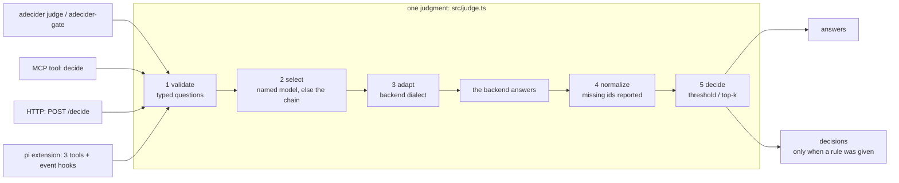

# adecider

Typed System One decisions for any coding agent. One call sends a piece of state plus a map of typed
questions (`noul`, `choice`, `score`) and gets back one calibrated answer per question id, from a single
request, as a number rather than prose. Backends are pluggable: a local Laya checkpoint by default,
TypeSafe Jev when you have a key, or any OpenAI-compatible model as a declared escape hatch.

The point is to stop asking a generative model to judge. A System One model returns probabilities
instead of prose, answers a dozen questions in one forward pass, and runs on this machine for free.

## How it works

Every surface calls the same `judge()`: the CLI, the MCP tool, the HTTP endpoint, and every pi feature.



A named backend is a hard constraint and never falls back. The chain that answers an unnamed request is
local by default: naming a cloud model is an explicit act, and a configured key is not consent to send
state off the machine. No threshold and no top-k means no verdicts: choosing a cutoff is the caller's
business.

## Quick start

```console
$ adecider judge \
    --state-file /tmp/diff.patch \
    --questions '{"satisfies":{"type":"noul","instructions":"Does the change report a refund for a duplicate charge?"},"risk":{"type":"score","instructions":"How risky is this change?","criteria":["trivial","routine","needs review","dangerous"]}}' \
    --threshold 0.7
{
  "backend": "laya-mlx",
  "calibration": "absolute",
  "elapsedMs": 51.5,
  "usage": { "inputTokens": 154, "outputTokens": 0 },
  "answers": {
    "satisfies": { "type": "noul", "value": 0.974, "score": 0.974, "confidence": 0.974 },
    "risk": {
      "type": "score", "value": 0.9, "score": 0.71, "confidence": 0.39,
      "distribution": { "0": 0.02, "1": 0.27, "2": 0.71, "3": 0.0 },
      "legend": { "0": "trivial", "1": "routine", "2": "needs review", "3": "dangerous" }
    }
  },
  "model": "english",
  "routing": { "checkpoint": "english", "reason": "English Latin text", "language": "en", "script": "latin" },
  "decisions": [
    { "id": "satisfies", "type": "noul", "value": 0.974, "score": 0.974, "passed": true },
    { "id": "risk", "type": "score", "value": 0.9, "score": 0.71, "passed": true }
  ]
}
```

- stdout carries JSON only, diagnostics go to stderr, exit `2` for a typed failure.
- `adecider-gate -c "the state reports a refund" --state-file /tmp/x` turns one criterion into an exit
  code: `0` pass, `1` fail, `2` error; `--fail-open` makes an outage a pass and says so on stderr.
- `adecider mcp-config` prints ready-to-paste config for pi, Claude Code, and Codex; `adecider serve`
  puts every model behind the HTTP format below.

## Backends

| Backend | Transport | Default endpoint | Calibration | Context window | Leaves this machine |
|---|---|---|---|---|---|
| `laya-mlx` | HTTP | `127.0.0.1:8317` | absolute | 512 (`english`), 1024 (`multilingual`) | no |
| `laya` | HTTP | `127.0.0.1:8318` | absolute | same | no |
| `jev` | HTTPS | `api.typesafe.ai/v1/systemone` | absolute | assumed 8192 | yes, and billed |
| any OpenAI-compatible | HTTP | **none: declare it** | ranking | assumed 4096 | only if the URL is not loopback |

`laya-mlx` and `laya` are the same model family behind two servers (MLX, and a PyTorch/MPS reference
build), speaking the same routes: `GET /health`, `POST /decide`, `POST /route`, body
`{state, questions|preset, model?}`.

An OpenAI-compatible server is never assumed: advertising whatever answers on a fixed port would put a
model into `adecider models` that nobody declared. Declare one to use it:

```json
{ "backends": { "local27b": { "kind": "openai", "baseUrl": "http://127.0.0.1:8090/v1", "model": "Ternary-Bonsai-2-27B-PQ2_0" } } }
```

`absolute` means a threshold means something, `ranking` means only `--top-k` is sound, and asking for a
threshold against a `ranking` backend is refused with `calibration` rather than silently downgraded.
`--allow-uncalibrated` overrides and marks every verdict `uncalibrated`. Separate from either: `score` is
the answer's strength, `confidence` is how concentrated the distribution is.

The windows are small, which is why a batched judgment covers about three described candidates:
`MEASUREMENTS.md` has the figures, `## Limits` has what that costs.

## Models

A caller names a model, not a service. `adecider models` lists what is reachable and how: a name can be
bare (`english`), qualified by transport (`laya-mlx:english`, `jev:jev-latest`), or a transport alone
(`jev`). Ids come from each backend's own health probe, so a backend that fails its probe contributes no
row and a service that loads a different checkpoint is described correctly.

The **`AUTO` column is the privacy boundary.** Everything configured and permitted is nameable, which is
how Jev is one of these models; only the ordered chain answers when nobody names one, and that chain is
local by default, because a local service being down is not consent to send source code to a hosted API.

## Surfaces

| Surface | Entry point | Contract |
|---|---|---|
| CLI | `adecider judge \| models \| status \| serve \| mcp-config` | stdout JSON only, exit `2` on a typed failure |
| CLI gate | `adecider-gate -c <criteria>` | exit `0` pass, `1` fail, `2` error |
| MCP | one tool, `decide`, over stdio JSON-RPC | a failed judgment is a result with `isError: true`, not a JSON-RPC error |
| HTTP | `adecider serve`, loopback by default | `GET /health`, `GET /models`, `POST /route`, `POST /decide` |

Failures keep their meaning over HTTP: `400` refused request, `401` missing key, `502` unreachable,
`503` busy, and `/health` stays `200` during an outage so a probe never infers state from a failure code.

The `decide` tool and `POST /decide` take the same fields:

| Argument | Meaning |
|---|---|
| `state` | the material to judge: text, a diff, a log, or a JSON object |
| `questions` | map of stable id to `{type, instructions, criteria}` |
| `model`, `backend` | a model selector, or a transport forced by name (`backend` never falls back) |
| `threshold`, `top_k` | the rule; both omitted means answers and no verdicts |
| `min_confidence` | a second gate on the confidence axis |
| `allow_uncalibrated` | threshold a ranking backend anyway, marking every verdict |

`noul` is a probability that a statement is true. `choice` takes a `criteria` object mapping option keys
to descriptions and returns the winner plus the full distribution. `score` takes a `criteria` array of
rubric levels ordered lowest first. Ask several questions per call: a dozen `noul` questions about one
state is one round trip.

## The pi extension

These features need to run inside the pi process: they react to events pi emits and call into pi's own
state, which an MCP server can neither receive nor do.

| Feature | Tool or command | Default |
|---|---|---|
| Typed judgment | `adecider_evaluate` | always on |
| Tool routing | `adecider_find_tools` | always available; automatic firing is off |
| Skill suggestions | `adecider_find_skill` | always available; automatic firing is off |
| Auto mode | `/adecider auto [on\|off]` | **off** |
| Model selection | `/adecider auto-model [on\|off]` | **off**, and spends no backend request |
| Tool guard | `/adecider tool-guard [on\|off]` | **off** |
| Model-guided compaction | `/adecider compact [on\|off]` | **off** |
| Orchestration | `/adecider agents <task>` | **off** |
| Evaluation design | `/adecider test <prompt>` | on demand |

Auto mode is the only feature that spends a backend request on every prompt: it judges which inactive
tools a prompt needs, activates them, and suggests skills. The tool guard spends one request per tool
call and is a filter for nonsense, not a hallucination detector. Compaction selects which history
entries survive, it does not write a summary, and it declines when there is no tool traffic to judge.
`/adecider status` reports what is on; `/adecider enable | disable` flips every automatic feature.

Other harnesses get judgment and gating only, over MCP or the CLI, because tool routing is the one
capability no MCP client can have: an MCP server cannot activate another server's tools.

## Configuration

`~/.pi/agent/adecider.json`, all fields optional:

```json
{
  "chain": ["laya-mlx", "laya"],
  "allowCloud": false,
  "backends": {
    "laya-mlx": { "kind": "laya", "baseUrl": "http://127.0.0.1:8317" },
    "local-27b": { "kind": "openai", "baseUrl": "http://127.0.0.1:8090/v1", "model": "Ternary-Bonsai-2-27B-PQ2_0" }
  },
  "harness": { "compact": true }
}
```

- Environment overrides: `ADECIDER_CONFIG` (path), `ADECIDER_CHAIN` (comma-separated),
  `ADECIDER_ALLOW_CLOUD=1`.
- Cloud use is off unless `allowCloud` or `ADECIDER_ALLOW_CLOUD=1` says otherwise. An
  OpenAI-compatible backend counts as cloud when its URL is not loopback.
- Chain order matters: the first backend that passes a health probe takes the call. Probe results are
  cached for 5 seconds, so a service that goes down is noticed without re-probing on every call.
- `harness` turns pi's automatic features on for every session. Only an explicit `true` counts; the keys
  are `auto`, `autoModel`, `toolGuard`, `compact`, `agents`. pi does not persist extension flags, so this
  is the only durable opt-in.
- `jev` is the one adapter that attaches a bearer key to every request, so its endpoint is allowlisted to
  the vendor host or loopback. Other adapters take any http(s) endpoint you declare.
- Behind a proxy, Node's `fetch` needs `NODE_USE_ENV_PROXY=1` as well as `HTTPS_PROXY`, or a hosted call
  fails as `unreachable`.

## Failure behaviour

Every failure is typed, and none of them produce a verdict: `unreachable`, `unconfigured`, `bad_request`,
`bad_response`, `timeout`, `busy`, `calibration`, `unsupported`. A backend that is down yields
`unreachable`, naming every probe that failed, and nothing is substituted. A payload this layer cannot
read yields `bad_response` rather than a guessed answer, and an asked id the backend did not answer
surfaces in `missing`. `busy` means the backend is up but overloaded, so an outage is never reported as
your mistake.

## Development

Node 23.6 or newer, the first release that runs the source as TypeScript with no flag, so there is no
build step and no runtime dependency.

```console
npm run check      # tsc --noEmit, then the suite: the one command before claiming a change works
npm test           # hermetic, prints its own count; the live tests skip when nothing listens
npm run status     # probe the chain: health, calibration, which backend is automatic
npm run smoke      # in a real pi process, that the extension registers its three tools
```

`bin/*.js` are two-line shims, so the CLI is one symlink away from being a command. CI runs
`npm run check` on Node 23.6 and 26 and needs no model. `pi -ne -e ./src/harness/pi/index.ts` loads the
extension in a dev session.

## Limits

- Tool routing exists only in the pi extension.
- Requests are budgeted against the answering backend's window, 512 tokens for the Laya English
  checkpoint, so a batched judgment covers about three candidates with descriptions, not ten. Dropped
  candidates are reported, never dropped in silence.
- Tool routing needs a lexical term match before it offers any candidate, and spends no request when
  nothing matches. A match on a single generic term can still admit a wrong candidate.
- The pre-execution tool guard is a filter for nonsense, not a hallucination detector, and its measured
  separation is too small to tune tighter. See `MEASUREMENTS.md`.
- No automatic mode is on by default, and `/adecider agents` needs a subagent runner installed.
- The local servers hold a global lock because the accelerator is shared, so concurrent judgments queue
  and `elapsedMs` includes queueing.
- The `openai` backend is for models that are not System One models: it must be declared, and its numbers
  are `ranking` only.

## Where the numbers are

Every figure this README used to carry, with the date and the machine it came from, is in
`MEASUREMENTS.md`: calibration margins, latencies, token counts, the request that was truncated before
budgeting existed, and the tool-guard separation. `AGENTS.md` is the guide for changing this repo.

## License

MIT.
