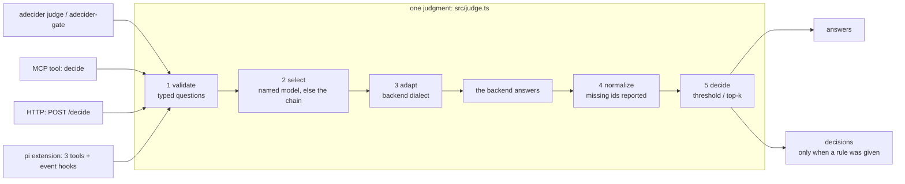

# adecider

[English](README.md) | **中文**

面向任何编程 agent 的类型化 System One 判定。一次调用传入一份 state 加一组带类型的问题
（`noul`、`choice`、`score`），返回每个问题 id 一个经过校准的答案；一次请求完成，给的是数字而不是
散文。后端可插拔：默认用本地 Laya checkpoint，有 key 时可用 TypeSafe Jev，也可把任意 OpenAI 兼容
模型作为显式声明的备用通道。

要点在于不要再让生成式模型去做判断。System One 模型返回概率而不是散文，一次前向传播回答十几个问题，
并在本机免费运行。

## 工作方式

所有入口都调用同一个 `judge()`：CLI、MCP 工具、HTTP 端点，以及每一个 pi 功能。



指名某个后端是硬约束，永不回落。无人指名模型时作答的自动链路默认全本地：指名云端模型是显式行为，
配置里有 key 不等于同意把 state 送出本机。既没有 threshold 也没有 top-k 就不产生 verdict：选 cutoff
是调用者自己的事。

## 快速开始

```console
$ adecider judge \
    --state-file /tmp/diff.patch \
    --questions '{"satisfies":{"type":"noul","instructions":"Does the change report a refund for a duplicate charge?"},"risk":{"type":"score","instructions":"How risky is this change?","criteria":["trivial","routine","needs review","dangerous"]}}' \
    --threshold 0.7
{
  "backend": "laya-mlx",
  "calibration": "absolute",
  "elapsedMs": 51.5,
  "usage": { "inputTokens": 154, "outputTokens": 0 },
  "answers": {
    "satisfies": { "type": "noul", "value": 0.974, "score": 0.974, "confidence": 0.974 },
    "risk": {
      "type": "score", "value": 0.9, "score": 0.71, "confidence": 0.39,
      "distribution": { "0": 0.02, "1": 0.27, "2": 0.71, "3": 0.0 },
      "legend": { "0": "trivial", "1": "routine", "2": "needs review", "3": "dangerous" }
    }
  },
  "model": "english",
  "routing": { "checkpoint": "english", "reason": "English Latin text", "language": "en", "script": "latin" },
  "decisions": [
    { "id": "satisfies", "type": "noul", "value": 0.974, "score": 0.974, "passed": true },
    { "id": "risk", "type": "score", "value": 0.9, "score": 0.71, "passed": true }
  ]
}
```

- stdout 只输出 JSON，诊断信息走 stderr，类型化失败的退出码是 `2`。
- `adecider-gate -c "the state reports a refund" --state-file /tmp/x` 把一条判据变成退出码：`0` 通过，
  `1` 不通过，`2` 出错；`--fail-open` 把后端故障变成通过，并在 stderr 说明。
- `adecider mcp-config` 打印可直接粘贴的配置，覆盖 pi、Claude Code、Codex；`adecider serve` 把每个
  模型放进下面那套 HTTP 格式。

## 后端

| 后端 | 传输 | 默认端点 | 校准 | 上下文窗口 | 是否离开本机 |
|---|---|---|---|---|---|
| `laya-mlx` | HTTP | `127.0.0.1:8317` | absolute | 512（`english`）、1024（`multilingual`） | 否 |
| `laya` | HTTP | `127.0.0.1:8318` | absolute | 同上 | 否 |
| `jev` | HTTPS | `api.typesafe.ai/v1/systemone` | absolute | 假定 8192 | 是，且计费 |
| 任意 OpenAI 兼容 | HTTP | **无：必须声明** | ranking | 假定 4096 | 仅当 URL 不是 loopback |

`laya-mlx` 与 `laya` 是同一模型家族的两个服务（MLX，以及 PyTorch/MPS 参考实现），路由和载荷相同：
`GET /health`、`POST /decide`、`POST /route`，body 为 `{state, questions|preset, model?}`。

OpenAI 兼容服务永不被默认假定：把固定端口上应答的服务当成本项目的模型，会让没人声明过的行进入
`adecider models`。要用就显式声明：

```json
{ "backends": { "local27b": { "kind": "openai", "baseUrl": "http://127.0.0.1:8090/v1", "model": "Ternary-Bonsai-2-27B-PQ2_0" } } }
```

`absolute` 表示阈值是有意义的，`ranking` 表示只有 `--top-k` 站得住；对 `ranking` 后端请求阈值会被
`calibration` 拒绝，而不是被悄悄降级成排名。`--allow-uncalibrated` 可以覆盖，并把每个 verdict 标成
`uncalibrated`。与这两者都不同的另一根轴：`score` 是答案的强度，`confidence` 是分布有多集中。

窗口很小，所以一次批量判定大约只覆盖三个带描述的被选者：数字在 `MEASUREMENTS.md`，代价见下面的
「限制」。

## 模型

调用者指名的是模型，不是服务。`adecider models` 列出可到达的模型及其到达方式：名字可以裸写
（`english`）、带传输前缀（`laya-mlx:english`、`jev:jev-latest`），或只写传输（`jev`）。id 来自各后端
自己的 health 探测，所以探测失败的后端不贡献任何行，换了 checkpoint 的服务也会被如实描述。

**`AUTO` 列就是隐私边界。** 所有已配置且被允许的后端都可被指名，Jev 也正是以这种方式成为可指名的
模型之一；无人指名时只有有序链路作答，而该链路默认全本地，因为本地服务宕机不构成把源码发给托管 API
的同意。

## 入口

| 入口 | 命令或端点 | 契约 |
|---|---|---|
| CLI | `adecider judge \| models \| status \| serve \| mcp-config` | stdout 只有 JSON，类型化失败退出 `2` |
| CLI gate | `adecider-gate -c <criteria>` | 退出 `0` 通过，`1` 不通过，`2` 出错 |
| MCP | 一个工具 `decide`，走 stdio JSON-RPC | 判定失败是带 `isError: true` 的结果，不是 JSON-RPC error |
| HTTP | `adecider serve`，默认只绑定 loopback | `GET /health`、`GET /models`、`POST /route`、`POST /decide` |

失败在 HTTP 上保持同样的含义：`400` 本层拒绝的请求，`401` 缺少 key，`502` 后端不可达，`503` 后端忙；
`/health` 在故障期间仍返回 `200`，所以探测方不必从失败码去推断状态。

`decide` 工具与 `POST /decide` 接受同样的字段：

| 参数 | 含义 |
|---|---|
| `state` | 要判断的材料：文本、diff、日志，或一个 JSON 对象 |
| `questions` | id 到 `{type, instructions, criteria}` 的映射 |
| `model`、`backend` | 模型选择器，或按名字强制某个传输（`backend` 永不回落） |
| `threshold`、`top_k` | 规则；两者都省略就只给答案、不给 verdict |
| `min_confidence` | 作用在 confidence 轴上的第二道门 |
| `allow_uncalibrated` | 仍然对 ranking 后端做阈值，并把每个 verdict 标记出来 |

`noul` 是一个命题为真的概率。`choice` 接受一个把选项 key 映射到描述的 `criteria` 对象，返回胜者和
完整分布。`score` 接受一个由低到高排列的 rubric 数组。一次调用多问几个问题：关于同一份 state 的十
几个 `noul` 问题只是一次往返。

## pi 扩展

这些功能必须跑在 pi 进程里：它们响应 pi 发出的事件，并调用 pi 自己的状态，而 MCP server 既收不到事件
也做不到这些。

| 功能 | 工具或命令 | 默认 |
|---|---|---|
| 类型化判定 | `adecider_evaluate` | 常开 |
| 工具路由 | `adecider_find_tools` | 始终可调用；自动触发关闭 |
| 技能建议 | `adecider_find_skill` | 始终可调用；自动触发关闭 |
| auto 模式 | `/adecider auto [on\|off]` | **关** |
| 模型选择 | `/adecider auto-model [on\|off]` | **关**，且不发后端请求 |
| 工具守卫 | `/adecider tool-guard [on\|off]` | **关** |
| 模型引导压缩 | `/adecider compact [on\|off]` | **关** |
| 编排 | `/adecider agents <task>` | **关** |
| 评测设计 | `/adecider test <prompt>` | 按需 |

auto 模式是唯一在每条 prompt 上花一次后端请求的功能：它判断需要哪些尚未激活的工具，把它们激活，并给出
技能建议。工具守卫每次工具调用花一次请求，它是胡编乱造的过滤器，不是幻觉检测器。压缩功能选择哪些历史
条目存活，它不写摘要，并且在没有可判定的工具流量时主动放弃。`/adecider status` 报告当前开着什么；
`/adecider enable | disable` 一次性翻转全部自动功能。

其他 harness 只能通过 MCP 或 CLI 获得判定与 gate，因为工具路由是 MCP 客户端唯一不可能具备的能力：
MCP server 无法激活另一个 server 的工具。

## 配置

`~/.pi/agent/adecider.json`，所有字段可选：

```json
{
  "chain": ["laya-mlx", "laya"],
  "allowCloud": false,
  "backends": {
    "laya-mlx": { "kind": "laya", "baseUrl": "http://127.0.0.1:8317" },
    "local-27b": { "kind": "openai", "baseUrl": "http://127.0.0.1:8090/v1", "model": "Ternary-Bonsai-2-27B-PQ2_0" }
  },
  "harness": { "compact": true }
}
```

- 环境变量覆盖：`ADECIDER_CONFIG`（配置文件路径）、`ADECIDER_CHAIN`（逗号分隔）、
  `ADECIDER_ALLOW_CLOUD=1`。
- 除非 `allowCloud` 或 `ADECIDER_ALLOW_CLOUD=1` 明确打开，云端使用始终关闭。OpenAI 兼容后端在 URL
  不是 loopback 时算作云端。
- 链路顺序有意义：第一个通过 health 探测的后端接下这次调用。探测结果缓存 5 秒，所以服务中途宕机不必
  每次调用都重新探测也能被发现。
- `harness` 让 pi 的自动功能在每个会话里默认开启。只有显式 `true` 才算，键是 `auto`、`autoModel`、
  `toolGuard`、`compact`、`agents`。pi 不持久化扩展 flag，所以这是唯一的持久开启方式。
- `jev` 是唯一给每个请求附加 bearer key 的适配器，所以它的端点被 allowlist 限制在厂商 host 或
  loopback。其他适配器接受你声明的任意 http(s) 端点。
- 走代理时，Node 的 `fetch` 需要 `NODE_USE_ENV_PROXY=1` 加 `HTTPS_PROXY`，否则托管调用会以
  `unreachable` 失败。

## 失败行为

所有失败都是类型化的，且都不产生 verdict：`unreachable`、`unconfigured`、`bad_request`、
`bad_response`、`timeout`、`busy`、`calibration`、`unsupported`。后端不可达时报 `unreachable`，并列出
失败的每一次探测，绝不做替代。本层读不懂的载荷报 `bad_response`，而不是猜一个答案；后端没有回答的
id 会出现在 `missing` 里。`busy` 表示后端在线但过载，所以过载永远不会被报成调用者的错。

## 开发

需要 Node 23.6 或更新版本，那是第一个无需 flag 就能直接运行 TypeScript 源码的版本，所以没有构建步骤，
也没有运行时依赖。

```console
npm run check      # tsc --noEmit，然后跑测试套件：声称改动可用之前唯一要跑的命令
npm test           # 密封，自己打印用例数；没有服务在监听时 live 测试跳过
npm run status     # 探测链路：健康、校准、哪个后端是自动作答的
npm run smoke      # 在一个真实 pi 进程里确认扩展注册了它的三个工具
```

`bin/*.js` 是两行的 shim，所以 CLI 距成为一个命令只差一个软链接。CI 在 Node 23.6 与 26 上跑
`npm run check`，不需要模型。`pi -ne -e ./src/harness/pi/index.ts` 在开发会话里加载扩展。

## 限制

- 工具路由只存在于 pi 扩展里。
- 请求按作答后端的窗口做预算，Laya 的 English checkpoint 是 512 token，所以一次批量判定大约覆盖三个
  带描述的被选者，而不是十个。被丢弃的候选项会被报告，绝不静默丢弃。
- 工具路由需要词法命中才会给出任何候选项，没有命中时不花请求。命中一个过于通用的词仍然可能放进错误
  的候选项。
- 工具守卫是胡编乱造的过滤器，不是幻觉检测器，实测出的分离度太小，无法把阈值调得更紧。见
  `MEASUREMENTS.md`。
- 没有任何自动模式默认开启，且 `/adecider agents` 需要安装 subagent runner。
- 本地服务因为共享加速器而持有全局锁，所以并发判定会排队，`elapsedMs` 包含排队时间。
- `openai` 后端面向的不是 System One 模型：必须显式声明，且它的数字只有 `ranking` 级别。

## 数字在哪里

这份 README 原本携带的每一个数字，连同它的测量日期和机器，都在 `MEASUREMENTS.md` 里：校准间隔、
延迟、token 数、在预算机制存在之前被截断的那次请求，以及工具守卫的分离度。`AGENTS.md` 是改动本仓库
的指南。

## License

MIT.
